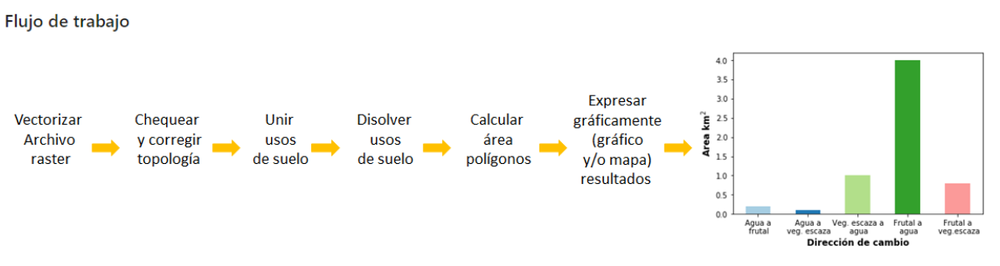
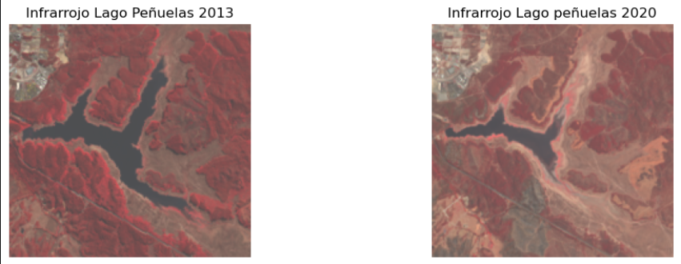
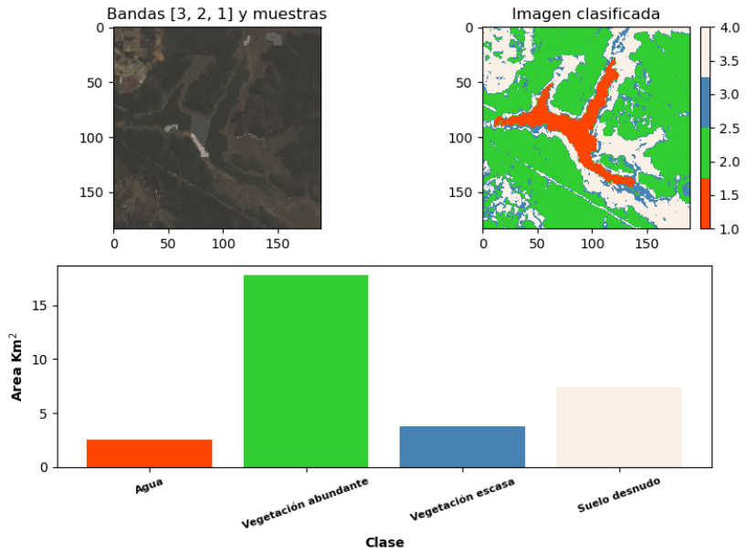
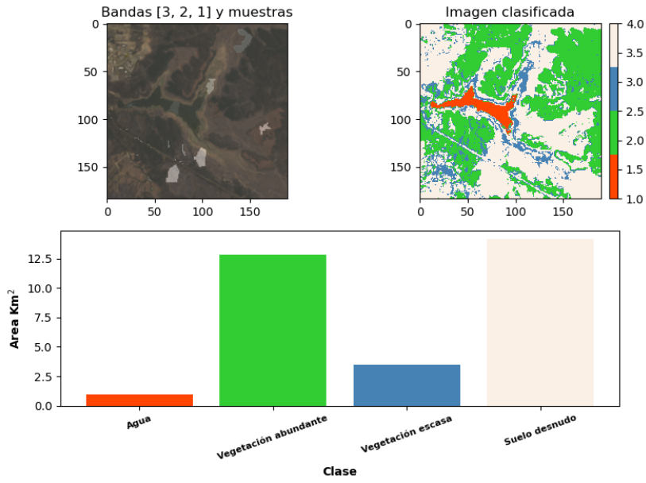
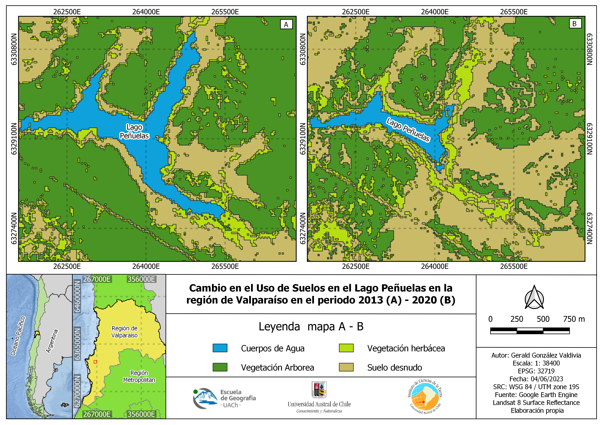
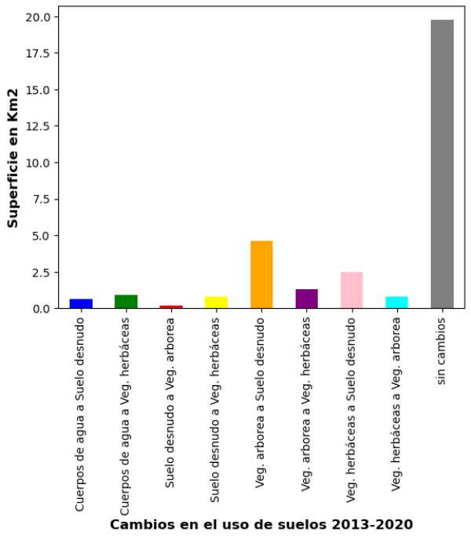

# Peñuelas Land Cover Change using Random Forest

Este proyecto presenta un flujo de trabajo para la clasificación supervisada de coberturas del suelo mediante el algoritmo **Random Forest**, utilizando imágenes Landsat, Python y QGIS. El objetivo es clasificar la cobertura del suelo para los años **2013** y **2020**, y cuantificar los cambios ocurridos en el área del Lago Peñuelas, Chile.

---

# Descripción general

**Random Forest** es un algoritmo de aprendizaje automático supervisado ampliamente utilizado para tareas de clasificación y regresión. En teledetección, permite clasificar cada píxel de una imagen satelital a partir de muestras de entrenamiento previamente etiquetadas.

El algoritmo construye múltiples árboles de decisión utilizando subconjuntos aleatorios de los datos de entrenamiento y de las variables predictoras. La clase final asignada a cada píxel corresponde a la votación mayoritaria entre todos los árboles, lo que permite obtener clasificaciones robustas y reducir el sobreajuste del modelo.

En este proyecto se implementó un modelo de **Random Forest con 100 árboles de decisión** para clasificar cuatro clases de cobertura del suelo y analizar los cambios ocurridos entre los años 2013 y 2020.

---

# Área de estudio

El área de estudio corresponde al **Lago Peñuelas**, ubicado en la Región de Valparaíso, Chile. Durante la última década, este sistema lacustre ha experimentado importantes cambios ambientales asociados principalmente a la prolongada sequía que afecta a la zona central del país, convirtiéndose en un caso de estudio adecuado para el análisis de cambios de cobertura mediante imágenes satelitales.

---

# Flujo de trabajo

La siguiente figura resume la metodología desarrollada durante este proyecto.

<p align="center">

</p>

---

# Datos de entrada

La clasificación supervisada requiere los siguientes insumos:

- Imagen multibanda Landsat (.tif)
- Polígonos de entrenamiento (.gpkg)
- Campo numérico denominado **id**, que identifica cada clase
- Campo descriptivo con el nombre de la cobertura (por ejemplo **Uso**)

### Ejemplo de ejecución

```python
multiband = r"SR_LC08_001083_20130505.tif"
poligonos = r"Poligonos_LC08_2013.gpkg"
columna = "Uso"

rf.randomforest(multiband, poligonos, columna)
```

---

# Imágenes Landsat

Se utilizaron composiciones en falso color (Bandas 5-4-3) para comparar visualmente las condiciones del área de estudio entre los años 2013 y 2020.

<p align="center">

</p>

---

# Clasificación supervisada mediante Random Forest

La clasificación fue realizada utilizando un modelo de **Random Forest con 100 árboles de decisión**.

El flujo general considera las siguientes etapas:

- Carga de la imagen multibanda.
- Lectura de los polígonos de entrenamiento.
- Extracción de firmas espectrales.
- Entrenamiento del modelo Random Forest.
- Clasificación de cada píxel.
- Exportación del raster clasificado.
- Cálculo de estadísticas de superficie por clase.

## Clases de cobertura

- Agua
- Vegetación escasa
- Vegetación abundante
- Suelo desnudo

## Resultados de la clasificación (2013)

- Número de píxeles de entrenamiento: **705**
- Exactitud (Out-of-Bag Score): **94.47 %**

### Importancia de las bandas

| Banda | Importancia (%) |
|-------:|----------------:|
| Banda 1 | 12.11 |
| Banda 2 | 14.28 |
| Banda 3 | 19.96 |
| Banda 4 | 17.29 |
| Banda 5 | 36.36 |

## Resultado de la clasificación (2013)

<p align="center">

</p>

## Resultado de la clasificación (2020)

<p align="center">

</p>

---

# Análisis de cambio de cobertura

Los raster clasificados correspondientes a los años 2013 y 2020 fueron comparados para identificar las transiciones entre clases de cobertura. Posteriormente, cada categoría fue etiquetada y resumida para cuantificar los cambios espaciales ocurridos durante el período de estudio.

El siguiente mapa muestra la distribución espacial de los cambios detectados.

<p align="center">

</p>

El siguiente gráfico resume las principales transiciones de cobertura entre ambos años.

<p align="center">

</p>

---

# Disponibilidad de los datos

Los datos originales **no se incluyen** en este repositorio debido al tamaño de los archivos.

Los insumos necesarios para reproducir el ejercicio son:

- Imágenes Landsat (2013 y 2020).
- Polígonos de entrenamiento (.gpkg).
- Raster clasificados generados por Random Forest.


---

# Software utilizado

- Python
- Jupyter Notebook
- QGIS
- GeoPandas
- Rasterio
- Pandas
- Matplotlib
- NumPy

---

# Agradecimientos

_Este proyecto fue desarrollado originalmente como parte del curso **Aplicaciones de los Sistemas de Información Geográfica (SIG) y Ordenamiento Territorial con SIG y TICs** de la carrera de **Geografía** de la **Universidad Austral de Chile (UACh)**._

## Recursos utilizados

Las imágenes satelitales corresponden a escenas **Landsat 8**, obtenidas mediante **Google Earth Engine**. El código utilizado para su descarga se encuentra disponible en:

- `scripts/google_earth_engine_download.txt`

El procesamiento de las imágenes multibanda (.tif), la clasificación supervisada mediante **Random Forest** y el análisis de cambio de cobertura fueron realizados en un cuaderno de **Google Colab**, disponible en:

- `notebooks/RandomForest_Colab.ipynb`

La actividad original fue adaptada para este repositorio con el propósito de documentar un flujo de trabajo reproducible para la clasificación supervisada de coberturas del suelo mediante el algoritmo **Random Forest**, utilizando imágenes Landsat, Python y QGIS.
